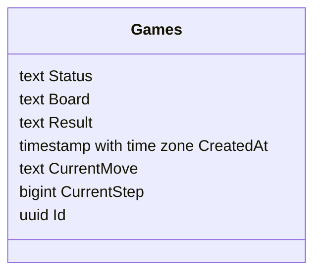

# API для приложение "Крестики-нолики" 

# Запуск
```
docker-compose up --build
```
**Замечание**: для перезагрузки базы данных выполните команду `docker-compose down -v`

# Архитектура приложения

- решение содержит проект `MinimalAPI` и проект `xUnit`

# Модель игры



# Основные функции

 - конфигурация приложения выполняется через переменные окружения
 - unit и интеграционные тесты работают локально по команде `dotnet test`
 - интеграционные тесты используют технологию `TestContainters`, для чего нужен Docker 
 - покрытие API тестами > 30%

[](https://github.com/artemovsergey/TicTacToe/actions/workflows/dotnet-test.yaml)
 - настроен ci/cd pipeline на github action на запуск тестов:

 - осуществлено развертывание на VPS:

[](https://github.com/artemovsergey/TicTacToe/actions/workflows/deploy.yml)
 
 - глобальная обработка ошибок через `middleware` и стандартизированная модель ответа для исключений 
 - асинхронная работа с данными с использованием токена отмены
 - взаимодействие с базой данных `Postgres` осуществляется через `EntityFrameWorkCore` посредством механизма миграций.
 - реализован выбор размерности поля игры
 - полностью настроен `openapi` через `swagger` 
 - предусмотрена валидация на входные данные
 - состояние игры храниться базе, что способствует восстановлению процесса игры
 - реализована проверка состояния игры на идемпотентность с помощью `ETag` в заголовках ответов

 # Новое

 - добавлены новые переменные окружения в виде **вероятности замены хода** и **частоты шага вероятности**. Теперь можно настраивать любую валидную вероятность и номер хода, на котором вероятность может сработать.
 - для проверки работоспособности API реализована связь с фронтендом на React https://tic-tac-toe-frontend-five.vercel.app/ (в разработке)